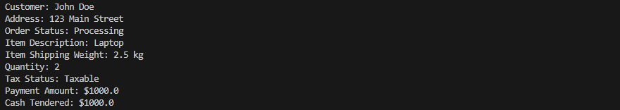

# Latihan_5

## Profil

| Variable        | Isi                         |
| --------------- | --------------------------- |
| **Nama**        | Dendi Permana               |
| **NIM**         | 312310694                   |
| **Kelas**       | TI.23.A.6                   |
| **Mata Kuliah** | Pemrograman Orientasi Objek |

### Latihan

#### Customer

    public class Customer {
    private String name;
    private String address;

        // Getters and Setters
        public String getName() {
            return name;
        }

        public void setName(String name) {
            this.name = name;
        }

        public String getAddress() {
            return address;
        }

        public void setAddress(String address) {
            this.address = address;
        }

    }

#### Item

    public class Item {
    private float shippingWeight;
    private String description;

        public float getPriceForQuantity(int quantity) {
            // Implement logic here
            return 0;
        }

        public float getTax() {
            // Implement logic here
            return 0;
        }

        public boolean inStock() {
            // Implement logic here
            return true;
        }

        // Getters and Setters
        public float getShippingWeight() {
            return shippingWeight;
        }

        public void setShippingWeight(float shippingWeight) {
            this.shippingWeight = shippingWeight;
        }

        public String getDescription() {
            return description;
        }

        public void setDescription(String description) {
            this.description = description;
        }

    }

#### OrderDetail

    public class OrderDetail {
    private int quantity;
    private String taxStatus;

        public float calcSubTotal() {
            // Implement logic here
            return 0;
        }

        public float calcWeight() {
            // Implement logic here
            return 0;
        }

        public float calcTax() {
            // Implement logic here
            return 0;
        }

        // Getters and Setters
        public int getQuantity() {
            return quantity;
        }

        public void setQuantity(int quantity) {
            this.quantity = quantity;
        }

        public String getTaxStatus() {
            return taxStatus;
        }

        public void setTaxStatus(String taxStatus) {
            this.taxStatus = taxStatus;
        }

    }

#### Order

    import java.util.Date;
    import java.util.List;

    public class Order {
    private Date date;
    private String status;
    private List<OrderDetail> lineItems;

        public float calcSubTotal() {
            // Implement logic here
            return 0;
        }

        public float calcTax() {
            // Implement logic here
            return 0;
        }

        public float calcTotal() {
            // Implement logic here
            return 0;
        }

        public float calcTotalWeight() {
            // Implement logic here
            return 0;
        }

        // Getters and Setters
        public Date getDate() {
            return date;
        }

        public void setDate(Date date) {
            this.date = date;
        }

        public String getStatus() {
            return status;
        }

        public void setStatus(String status) {
            this.status = status;
        }

        public List<OrderDetail> getLineItems() {
            return lineItems;
        }

        public void setLineItems(List<OrderDetail> lineItems) {
            this.lineItems = lineItems;
        }

    }

#### Credit

    public class Credit extends Payment {
    private String number;
    private String type;
    private String expDate;

        public boolean authorized() {
            // Implement logic here
            return true;
        }

        // Getters and Setters
        public String getNumber() {
            return number;
        }

        public void setNumber(String number) {
            this.number = number;
        }

        public String getType() {
            return type;
        }

        public void setType(String type) {
            this.type = type;
        }

        public String getExpDate() {
            return expDate;
        }

        public void setExpDate(String expDate) {
            this.expDate = expDate;
        }

    }

#### Payment

    public abstract class Payment {
    protected float amount;

        // Getters and Setters
        public float getAmount() {
            return amount;
        }

        public void setAmount(float amount) {
            this.amount = amount;
        }

    }

#### Cash

    public class Cash extends Payment {
    private float cashTendered;

        // Getters and Setters
        public float getCashTendered() {
            return cashTendered;
        }

        public void setCashTendered(float cashTendered) {
            this.cashTendered = cashTendered;
        }

    }

#### Check

    public class Check extends Payment {
    private String name;
    private String bankID;

        public boolean authorized() {
            // Implement logic here
            return true;
        }

        // Getters and Setters
        public String getName() {
            return name;
        }

        public void setName(String name) {
            this.name = name;
        }

        public String getBankID() {
            return bankID;
        }

        public void setBankID(String bankID) {
            this.bankID = bankID;
        }

    }

#### Main

    import java.util.Date;

    public class Main {
    public static void main(String[] args) {
    // Membuat objek Customer
    Customer customer = new Customer();
    customer.setName("John Doe");
    customer.setAddress("123 Main Street");

            // Membuat objek Item
            Item item = new Item();
            item.setShippingWeight(2.5f);
            item.setDescription("Laptop");

            // Membuat OrderDetail
            OrderDetail orderDetail = new OrderDetail();
            orderDetail.setQuantity(2);
            orderDetail.setTaxStatus("Taxable");

            // Membuat objek Order
            Order order = new Order();
            order.setDate(new Date());
            order.setStatus("Processing");

            // Membuat Payment (Cash)
            Cash cashPayment = new Cash();
            cashPayment.setAmount(1000.0f);
            cashPayment.setCashTendered(1000.0f);

            // Output contoh
            System.out.println("Customer: " + customer.getName());
            System.out.println("Address: " + customer.getAddress());
            System.out.println("Order Status: " + order.getStatus());
            System.out.println("Item Description: " + item.getDescription());
            System.out.println("Item Shipping Weight: " + item.getShippingWeight() + " kg");
            System.out.println("Quantity: " + orderDetail.getQuantity());
            System.out.println("Tax Status: " + orderDetail.getTaxStatus());
            System.out.println("Payment Amount: $" + cashPayment.getAmount());
            System.out.println("Cash Tendered: $" + cashPayment.getCashTendered());
        }

    }

##### Output

